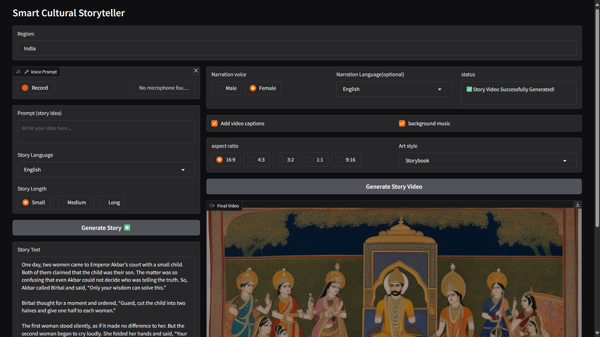

# 🎭 Smart Cultural Storyteller v1.0


> **An AI-powered storytelling system that bridges cultural heritage and modern artificial intelligence.** It transforms a simple user prompt into a multilingual cultural story and automatically generates a narrated story video with AI-generated illustrations, synchronized captions, and context-aware background music.

---

### 🖥️ Application Preview

<p align="center">
  
</p>

---
# 📖 Project Overview :

Most traditional and cultural stories are still shared in text or oral formats, which often feel outdated and less engaging for younger audiences. Creating digital storytelling content usually requires writing scripts, recording narration, designing visuals, and editing videos, which demands both time and technical skills. 

The aim of this project is to build an AI-powered system capable of automatically generating complete story videos with audio narration, captions, and background music while keeping authentic, making cultural storytelling more modern, engaging, and accessible. 

The system integrates multiple open-source AI models and techniques, including large language models for story generation, a FAISS-based Retrieval-Augmented Generation (RAG) pipeline for contextual grounding, semantic retrieval for intelligent background music selection, and a translation layer to support multilingual storytelling. The current version was developed primarily in **Google Colab**.   

Future versions will focus on modular architecture, improved performance, and deployment on **Hugging Face Spaces**.

---

# 🎯 Project Objectives:

* Generate culturally relevant stories from user prompts.
* Split stories into meaningful scenes.
* Create an illustration for every scene using generative AI.
* Generate natural narration using text-to-speech.
* Select suitable background music.
* Combine images, narration, and music into a complete story video.

---

# ✨ Key Features

- 📝 AI-powered cultural story generation from a user prompt
- 🔍 Retrieval-Augmented Generation (RAG) for culturally relevant storytelling
- 🌐 Multilingual story translation
- 🎬 Automatic scene-wise story segmentation
- 🎨 AI-generated illustrations for each story scene
- 🎤 High-quality narration using Text-to-Speech (TTS)
- 🎵 Context-aware background music selection
- 🎞️ Automatic story video generation with synchronized visuals, narration, and subtitles
- 🔄 End-to-end automated storytelling pipeline

---

# 🏗️ Project Pipeline

The complete workflow is illustrated below.
<p align="center">

</p>

## 🚀 How It Works

1. User enters a story idea.
2. Relevant cultural context is retrieved using RAG.
3. The language model generates a culturally grounded story.
4. The story is divided into individual scenes.
5. A visual prompt is created for each scene.
6. Images are generated using an AI image model.
7. Narration is created using text-to-speech.
8. Background music is selected.
9. Everything is merged into a final story video.

---

# 🎵 Smart Background Music Selection

One of the interesting components of this project is the **Smart Background Music Selection** feature.

<p align="center">

</p>

Instead of using a fixed soundtrack, the system attempts to select music that better matches the mood of the story.

---

# 🧠 Technologies Used

### Programming

* Python

### Development Platform

* Google Colab

### Core AI & Machine Learning

* PyTorch
* Transformers

### Image Generation

* Stable Diffusion

### Semantic Search

* Sentence Transformers
* FAISS

### Translation & Language Detection

* deep-translator
* langdetect

### Speech-to-Text

* openai-whisper
* SpeechRecognition

### Text-to-Speech

* gTTS
* EdgeTTs

### Audio & Video Processing

* Pydub
* MoviePy
* ffmpeg-python

### Other Utilities

* gradio
* numpy
* pandas
* requests
* wikipedia
* beautifulsoup4
* Pillow
* reportlab


---

---
## 🎥 Project Demonstration

A complete walkthrough of the project has been recorded to explain the overall architecture, implementation, and results.

Due to GitHub's file size limitations, the project resources are hosted on **Google Drive**.

### 📁 Project Resources

| Resource                  | Description                                                     | Link                                                                                                          |
| ------------------------- | --------------------------------------------------------------- | ------------------------------------------------------------------------------------------------------------- |
| 📂 Project Files          | Complete project assets, outputs, and supporting files          | **[Open Project Folder](https://drive.google.com/drive/folders/1MggtQNwYASTBidgn1dWgmCdRuY0zqQPj?usp=sharing)**        |
| 🎬 Project Overview Video | Full walkthrough of the project architecture and implementation | **[Watch Project Overview](https://drive.google.com/file/d/1H_nwU-HONFN7cu73copS4TeFeruwrds3/view?usp=sharing)** |

### 📽️ What the video covers

* Project objectives
* System architecture
* Workflow explanation
* Story generation pipeline
* AI image generation
* Text-to-speech narration
* Smart background music selection
* Final video generation
* Future improvements

---
# 📂 Repository Structure

```text
smart_cultural_storyteller_v1.0/
│
├── notebooks/
│   └── SmartCulturalStoryteller_Pipeline.ipynb
│
├── outputs/
│   └── story_video.mp4
│
├── report_docs/
│   └── Project_Report.pdf
│
├── README.md
└── requirements.txt

```


---

# 📊 Version Information

| Version | Status     | Description                                                |
| ------- | ---------- | ---------------------------------------------------------- |
| v1.0    | ✅ Stable   | Google Colab prototype                                     |
| v2.0    | 🚧 Planned | Modular Python project with Hugging Face Spaces deployment |


# 🔮 Future Improvements (v2.0)

* Deploy on Hugging Face Spaces
* Replace notebook with a modular Python application
* Interactive Gradio interface
* Faster image generation
* Better prompt engineering
* Improved narration quality
* Enhanced background music recommendation

---

# 👨‍💻 Author

**Abhishek Kumar**

AI & Machine Learning Enthusiast

---

# ⭐ Support

If you found this project useful or interesting:

* ⭐ Star this repository
* 🍴 Fork the project
* 💡 Share suggestions and ideas

Contributions and feedback are always welcome.

---

# 📜 License

This project is released for educational and research purposes.

Please provide appropriate attribution if you build upon this work.
